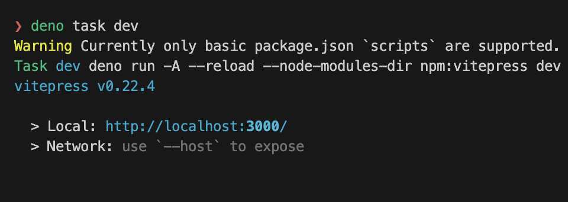

# vitepress-on-deno (issue)

Run `deno task dev`. It uses `vitepress@0.22.4` instead of the specified version `1.0.0-rc.5` in `package.json`.



Manually specifying version like `npm:vitepress@1.0.0-rc.5` works.

Generated node_modules tree:

```
 node_modules
├──  .deno
│   ├──  vitepress@0.22.4
│   │   └──  .initialized
│   └──  vitepress@1.0.0-rc.5
│       └──  .initialized
├──  vitepress ⇒ /Users/brc-dd/vitepress-on-deno/node_modules/.deno/vitepress@1.0.0-rc.5/node_modules/vitepress
└──  vue ⇒ /Users/brc-dd/vitepress-on-deno/node_modules/.deno/vue@3.3.4/node_modules/vue
```
